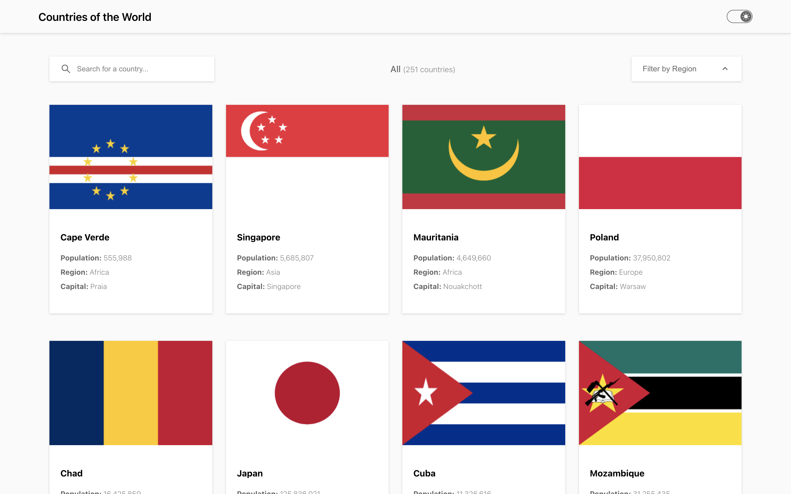
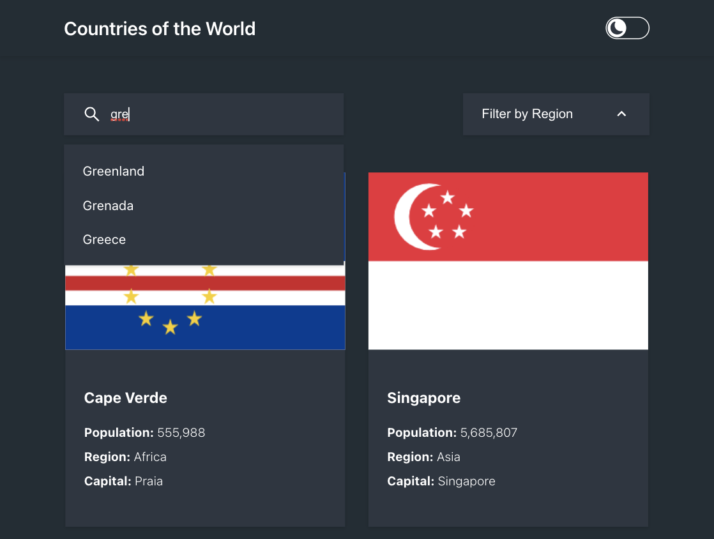
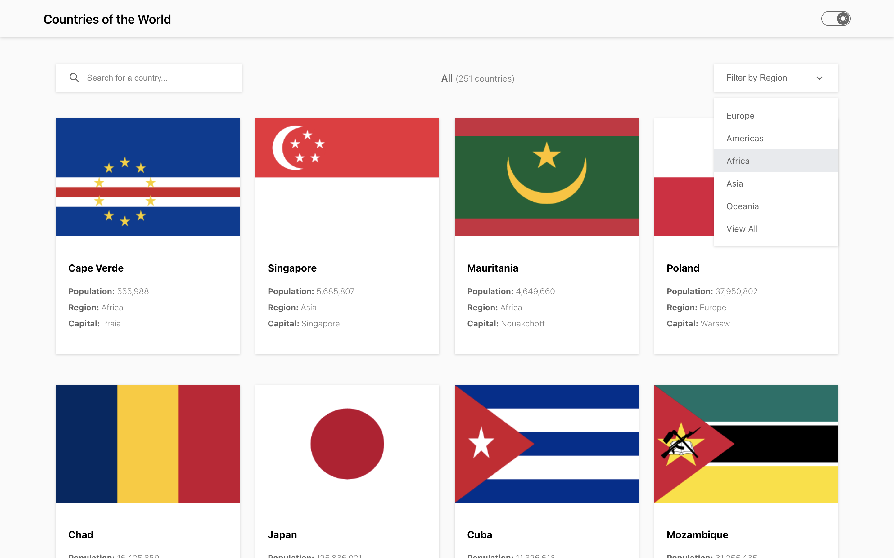
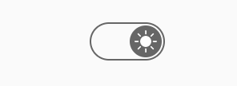
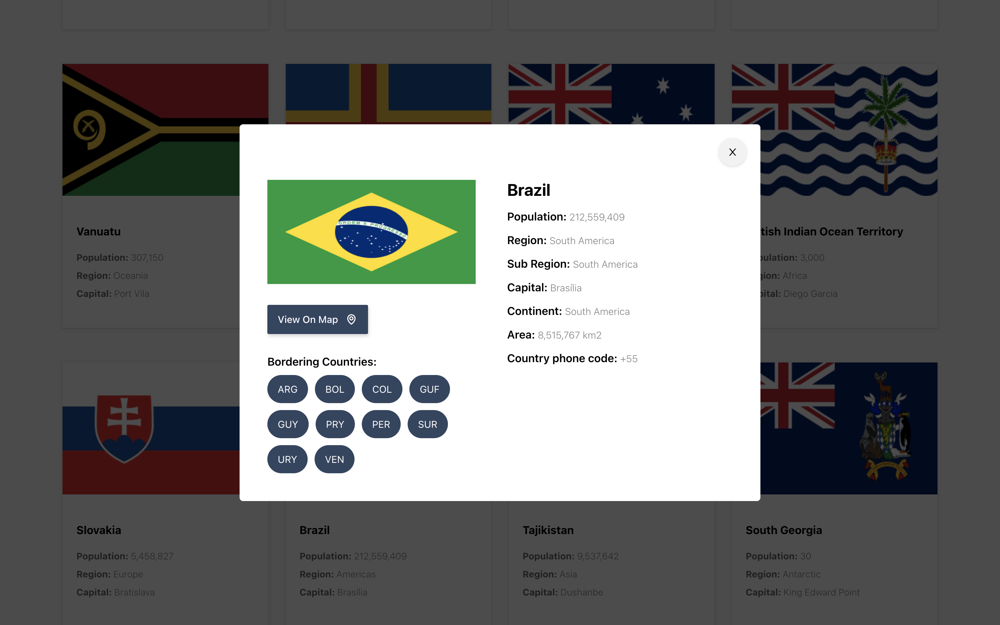
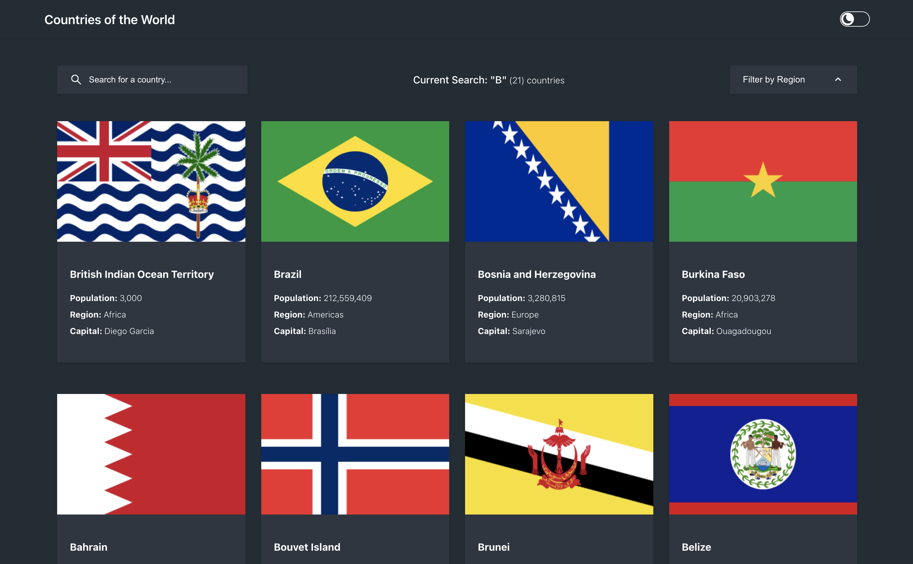
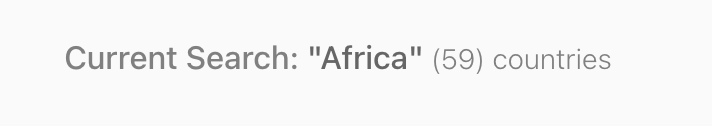

# COUNTRIES APP

Welcome to th countries app where you can search for any of the world countries by region in the dropdown menu, or directly in the input bar. Click on any country to see more detailed information. Once here, you can view the country on google maps, or click through to it's neighboring countries.



## DEPLOYED SITE:

Follow this link to have a play around on the app on your own.

Alternatively, you can create a fork of this repo, then run:

```
npm i
```

to install all the dependencies, and then run:

```
npm start
```

to run the app on your localhost.

## FEATURES

This web application has a number of key features that are worth knowing about and trying for yourself:

### SEARCH INPUT BAR
- A custom built search bar that enables you to search for any country. It will display in a menu below all of the countries that start with the the letters you input. 



### DROPDOWN MENU
- The custom dropdown menu enables you to search for countries by region. Also, the Chevron is animated so it rotates 180 degrees in a smooth motion.



### DARKMODE TOGGLE
- This is another custom built feature. The Funtionality changes the color theme from light to dark when clicked. The button itself is custom made using some cool CSS tricks to make it transition smoothly from side to side.




### COUNTRY MODAL
- When you select a country, a modal will appear with more details about the country as well as a link to google maps, and option to click thrlugh to bordering countries.



### API DATA
- The country data is fetched from the REST Countries API. Once fetched, it is stored in an array as state and then used throughout the application.

### BORDER CLICK THROUGH
- When you are on the Country modal, you have the option to view the bordering countries by clicking on the button. The same modal will appear, but now with the data of the county you clicked on. This is another way of viewing country information.

### CLOSE OFF CLICK
- Being able to close the region dropdown or the input dropdown when clicking of them was a really important functionality I wanted to implement. Both function really nicely, and only one is ever open at a time.

### GRID LAYOUT
- The countries on the main screen are laid out using the CSS Grid layout. It's a great way to display a really clean layout. And this offers a great example of it's use.



## TECH STACK

The tech stack for this front-end project is:

- REACT
- TYPESCRIPT
- STYLED COMPONENTS


## LEARNING POINTS

This project covered a number of learning points, some of which are new areas.

### ARRAY METHODS
  - filter - filter through API data and create a new array with desired output.
  - Map - iterate through the array that then enables you to display the desired content of that array, for instance, the countries on the main screen.
  


### Hooks
- useContext - Tidy way to manage the state and functions and then distribute them throughout the app where needed.
- UueEffect - used for the API fetch request to fetch the data upon page render. 
- useState - used to store the the various data, which can then be used throughout the app.

### Event Handling
- close element when clicking anywhere outside of it - dropdown & input menus, and country modal.

### toggle color themes 
- create a light and dark theme on the app compoent, wrap the app in a theme provider, pass in the themes as props to the styled components, toggle theme with state and a ternary Operator.

### grid layout
- using css flex:grid, the country was laid out in a clean and easy to manage way. Would absolutely reccomend using flex:grid for a use case such as this.


## CHALLENGES

### displaying results based on user search
It was really important to give the user a good searching experience. The Dropdown and input menus give the user an opportunity to refine their search by region, by country name, or even by starting letters. For instance, searching for 'FR' would display all the countries starting with FR. 

### displaying the searched input live as the user types
This was a really exciting challenge to overcome. As the user types, the input is being stored in a state, on change. The entire list of counties is filtered by matching the unput text to the any country names that astart with it, which is then stored to a new 'filtered' array. I then map through the new filtered array, which is what displays in a list when you type. 

Making this list interactive was also a big challenge. I worked it out by setting the 'filtered countries' array to filter through the countries array and then return any country that started with the input text. These countries would then be displayed in the grid


## FUTURE ITERATIONS

### display full names for border instead on abbreviations 
I give this a good shot but am so far still trying to figure out how to display the border names in full rather than just the abbreviations. If you fancy giving yourself a good challenge, why not fork this repo and see if you can work it out. If you do, I'd love to hear how you worked it out.


## TODO

- setTimeout for countryModal - currently when you click off and on too quickly, the aray hasnt filled and the container is blank
- add +1 for countries.length in the nav - DONE
- make countries modal responsive - DONE
- make nav responsive - DONE
- display country name rather than abbrev for borders
- link between countries when click on border - DONE
- style countryModal - DONE
- create a darkmode toggle - DONE
- create off click for both the dropdown and search - DONE
- Write Read me
  -  Deploy site
     - Add link
  - take screen shots
    - add to images folder in public
    - add throughout readme
- add to portfolio
  - create cover image

how to return the border full word rather than the initials?

1 - Match the border initials with the country initials - .find method
2 - save it to a new array (array of countries)
3 - map through new array and display country.name.common

setModalCountryBorders(modalCountry[0].borders)

https://www.youtube.com/watch?v=zgd-z3R1o2k

